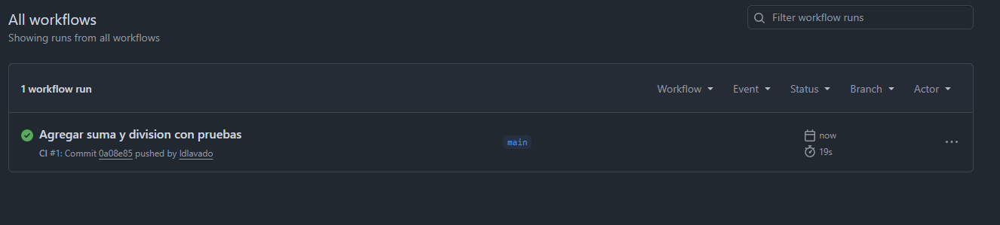
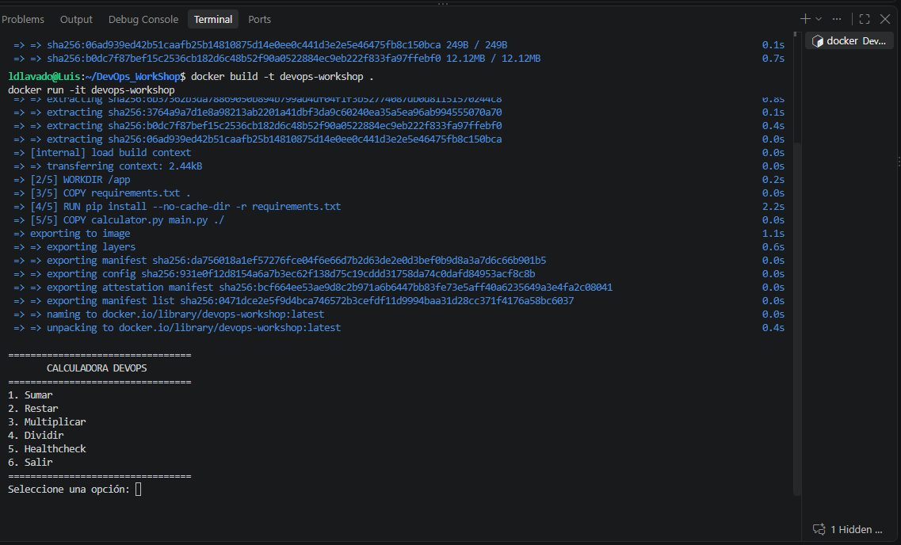
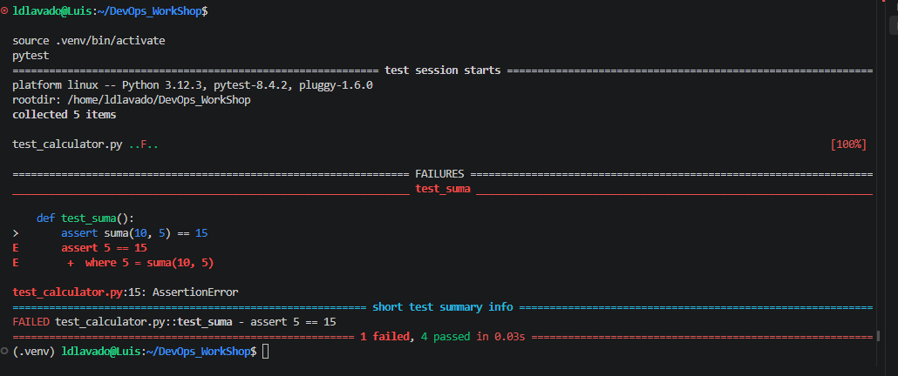
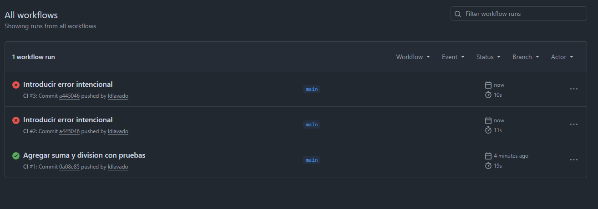
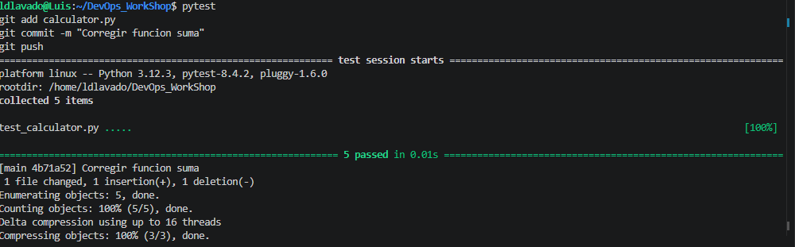
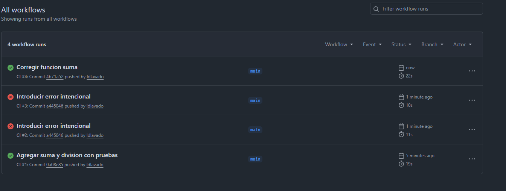

# Taller práctico de DevOps: De código a producción

## Objetivo

Documentar el flujo completo realizado en este taller:

**Código → Pruebas → Git → GitHub → GitHub Actions → Docker → Feedback → Corrección**

El proyecto es una calculadora de consola en Python. El trabajo incluye la implementación de las operaciones, sus pruebas automatizadas, la integración continua en GitHub Actions, la construcción de una imagen Docker y la observación de un fallo intencional seguido de su corrección.

## Qué quedó implementado

- `calculator.py`: `suma`, `resta`, `multiplicacion` y `division`. La división lanza `ValueError` si `b == 0`.
- `main.py`: menú de opciones 1 a 6 con las cuatro operaciones, healthcheck y salida.
- `test_calculator.py`: 5 tests para resta, multiplicación, suma, división y división entre cero.
- `Dockerfile`: imagen basada en `python:3.12-slim` que ejecuta `main.py`.
- `.github/workflows/ci.yml`: ejecución de `pytest` y `docker build -t devops-workshop .` en pushes y pull requests hacia `main`.

## Estructura del proyecto

```text
DevOps_WorkShop/
├── .github/
│   └── workflows/
│       └── ci.yml
├── evidence/
│   ├── CI.png
│   ├── CI-1.png
│   ├── CI-2.png
│   ├── CI-3.png
│   ├── CI-4.png
│   └── CI-5.png
├── .gitignore
├── Dockerfile
├── README.md
├── calculator.py
├── main.py
├── requirements.txt
└── test_calculator.py
```

## Requisitos y arranque

Requisitos:

- Python 3.12 o superior
- Git
- Docker
- Cuenta y acceso al repositorio de GitHub

Repositorio: <https://github.com/ldlavado/DevOps_Workshop>

```bash
git clone git@github.com:ldlavado/DevOps_Workshop.git
cd DevOps_WorkShop
python3 -m venv .venv
source .venv/bin/activate
pip install -r requirements.txt
python main.py
pytest
```

El menú final de la aplicación es:

```text
1. Sumar
2. Restar
3. Multiplicar
4. Dividir
5. Healthcheck
6. Salir
```

El healthcheck muestra el estado `OK` de la aplicación. La opción de división informa el error cuando se intenta dividir entre cero sin cerrar el programa.

## Flujo completado

### 1. Implementación y primer pipeline exitoso

Se agregaron `suma` y `division`, junto con sus pruebas. El primer pipeline terminó correctamente después del commit `Agregar suma y division con pruebas`.



### 2. Validación con Docker

La imagen se construyó con el nombre `devops-workshop` y el contenedor se ejecutó de forma interactiva. La captura muestra el menú completo de la calculadora dentro del contenedor.



### 3. Fallo intencional en las pruebas

Se introdujo un error intencional en la función de suma para comprobar que las pruebas y la integración continua detectaran una regresión. La ejecución local falló en `test_suma` con la aserción `5 == 15`.



El mismo cambio provocó que GitHub Actions quedara en rojo en los runs asociados a `Introducir error intencional`.



### 4. Corrección y recuperación

Se corrigió la función `suma`, se verificaron nuevamente las cinco pruebas y se enviaron los cambios con el commit `Corregir funcion suma`.



El historial final de Actions muestra la secuencia esperada: pipeline verde para la implementación de suma y división, pipeline rojo para el error intencional y pipeline verde después de la corrección.



## Comandos principales

Ejecutar las pruebas locales:

```bash
source .venv/bin/activate
pytest
```

Construir y ejecutar la aplicación con Docker:

```bash
docker build -t devops-workshop .
docker run -it devops-workshop
```

El pipeline de GitHub Actions ejecuta automáticamente:

```bash
pytest
docker build -t devops-workshop .
```

## Reflexión final

Durante este taller aprendí que DevOps es un flujo continuo de colaboración, automatización y feedback, no solamente un conjunto de herramientas. El control de versiones permitió registrar cada cambio y distinguir claramente la implementación inicial, el error intencional y la corrección.

Las pruebas automatizadas detectaron rápidamente que la suma estaba rota, primero en la ejecución local y después en GitHub Actions. La Integración Continua convirtió esa comprobación en un proceso automático para cada cambio enviado al repositorio, evitando que una regresión pasara desapercibida.

Docker permitió ejecutar la misma aplicación en un entorno reproducible y comprobar que el menú funcionara dentro de un contenedor. En conjunto, Git, pytest, GitHub Actions y Docker hicieron visible el ciclo completo: modificar, probar, integrar, recibir feedback y corregir. La principal conclusión es que la automatización acorta el tiempo de detección de errores y aporta confianza al proceso de entrega de software.

## Resultado

El taller quedó completado con el flujo de feedback verificado: una implementación funcional pasó las pruebas y el pipeline, un error intencional fue detectado localmente y en GitHub Actions, y la corrección restauró el estado verde con las cinco pruebas aprobadas.
